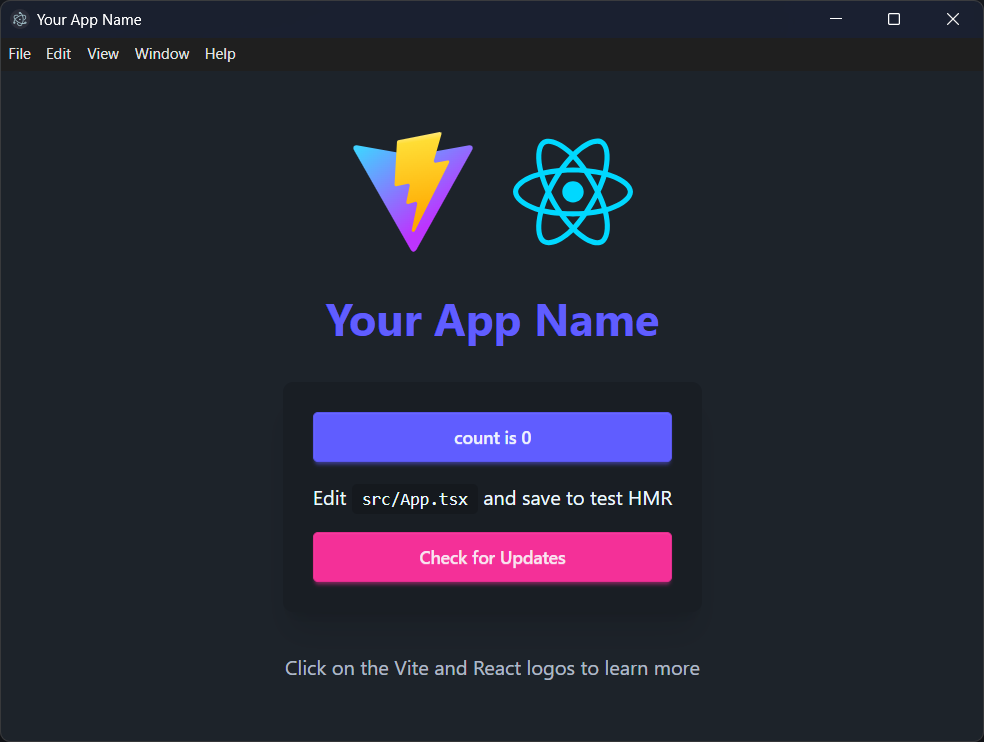

# Electron + Vite + React + TypeScript + DaisyUI Boilerplate

[](https://opensource.org/licenses/MIT)
[](https://nodejs.org/)
[](https://electronjs.org/)
[](https://vitejs.dev/)
[](https://react.dev/)
[](https://www.typescriptlang.org/)
[](https://daisyui.com/)

A modern Electron application boilerplate built with Vite, React, TypeScript, and DaisyUI. This template provides a complete development environment with hot reload, auto-updater functionality, and a beautiful UI framework.



## 💡 Motivation

I created this boilerplate because I couldn't find thorough documentation on **electron-builder NSIS** and **electron-updater auto updates**. Setting up these features can be quite a headache, so I built this template with everything properly configured to help others avoid the same struggles.

## 🚀 Features

- **⚡️ Vite** - Lightning fast build tool and dev server
- **⚛️ React 18** - Modern React with hooks
- **📝 TypeScript** - Type safety and better developer experience
- **🎨 DaisyUI** - Beautiful component library built on Tailwind CSS
- **🔄 Hot Reload** - Instant updates during development
- **📦 Auto Updater** - Built-in update mechanism using electron-updater
- **🔧 ESLint** - Code linting and formatting
- **📱 Cross-platform** - Build for Windows, macOS, and Linux

## 📋 Prerequisites

- Node.js 18+ 
- npm or yarn
- Git

## 🛠️ Quick Start

### 1. Clone the Repository

```bash
git clone https://github.com/kethakav/electron-vite-react-boilerplate.git
cd electron-vite-react-boilerplate
```

### 2. Install Dependencies

```bash
npm install
```

### 3. Start Development

```bash
npm run dev
```

This will start both the Vite dev server and Electron in development mode with hot reload.

## 📁 Project Structure

```
├── electron/                 # Electron main process files
│   ├── main.ts              # Main process entry point
│   ├── preload.ts           # Preload script for IPC
│   ├── update.ts            # Auto-updater logic
│   └── electron-env.d.ts    # TypeScript definitions
├── src/                     # React application source
│   ├── App.tsx             # Main React component
│   ├── main.tsx            # React entry point
│   ├── App.css             # Component styles
│   └── assets/             # Static assets
├── public/                  # Public assets
├── dist/                    # Built renderer files
├── dist-electron/           # Built main process files
├── release/                 # Release builds
├── electron-builder.json    # Electron Builder configuration
├── vite.config.ts          # Vite configuration
└── package.json            # Project dependencies and scripts
```

## 🔧 Configuration

### Required Changes

Before using this boilerplate for your project, you need to update the following files:

#### 1. `package.json`
```json
{
  "name": "your-app-name",
  "version": "1.0.0",
  "description": "Your app description"
}
```

#### 2. `electron-builder.json`
```json
{
  "appId": "com.yourcompany.yourapp",
  "productName": "Your App Name",
  "publish": {
    "provider": "github",
    "owner": "yourusername",
    "repo": "your-repo-name"
  }
}
```

#### 3. `index.html`
```html
<title>Your App Name</title>
```

#### 4. `src/App.tsx`
Update the app title and branding:
```tsx
<h1 className="text-4xl font-bold text-center mb-8 text-primary">Your App Name</h1>
```

#### 5. `electron/main.ts`
Update the window icon:
```ts
icon: path.join(process.env.VITE_PUBLIC, 'your-icon.png'),
```

### Optional Changes

#### 1. App Icon
Replace the icons in the `public/` directory:
- `vite.svg` - Your app icon
- `electron-vite.svg` - Alternative icon

#### 2. Window Configuration
Modify `electron/main.ts` to customize the window:
```ts
win = new BrowserWindow({
  width: 1200,
  height: 800,
  minWidth: 800,
  minHeight: 600,
  // ... other options
})
```

#### 3. Auto Updater
The auto-updater is configured in `electron/update.ts`. You can customize:
- Update check frequency
- Download behavior
- Update notifications

## 🚀 Available Scripts

- `npm run dev` - Start development server with hot reload
- `npm run build` - Build for production
- `npm run preview` - Preview production build
- `npm run lint` - Run ESLint

## 📦 Building for Production

### Development Build
```bash
npm run build
```

### Release Build
The build process will create distributable packages in the `release/` directory:
- Windows: `.exe` installer
- macOS: `.dmg` disk image
- Linux: `.AppImage` and `.deb` packages

## 🔄 Auto Updater

This boilerplate includes a complete auto-update system:

### Features
- Automatic update checking
- Progress tracking
- Error handling
- User notifications

### Configuration
1. Set up a GitHub repository for releases
2. Update `electron-builder.json` with your repository details
3. Configure GitHub Actions for automated releases

### Usage
The update system is automatically integrated. Users can check for updates via the UI button.

## 🚀 Releasing Updates

This boilerplate includes automated release publishing via GitHub Actions. Here's how to release a new version:

### Prerequisites
1. **GitHub Token**: Create a personal access token with `repo` permissions
2. **Repository Secret**: Add your token as `RELEASE_PUSH_TOKEN` in your repository settings
3. **Release Repository**: Set up a separate repository for releases (e.g., `your-app-releases`)

### Release Process

1. **Update Version**
   ```bash
   # Update version in package.json
   npm version patch  # or minor, major
   ```

2. **Create and Push Tag**
   ```bash
   # Create a new tag (GitHub Actions will trigger on v* tags)
   git tag v1.0.1
   git push origin v1.0.1
   ```

3. **Automated Build**
   - GitHub Actions will automatically:
     - Build the application
     - Create Windows installer
     - Publish to your release repository
     - Update the auto-updater

### Configuration Files

Update these files for your release setup:

#### `electron-builder.json`
```json
{
  "publish": {
    "provider": "github",
    "owner": "yourusername",
    "repo": "your-app-releases"
  }
}
```

#### GitHub Repository Settings
1. Go to Settings → Secrets and variables → Actions
2. Add `RELEASE_PUSH_TOKEN` with your GitHub token
3. Ensure the token has `repo` permissions

### Release Workflow
The workflow triggers on tags matching `v*` pattern and:
- Builds the application
- Creates Windows installer
- Publishes to your release repository
- Enables auto-updates for users

## 🎨 Styling with DaisyUI

This boilerplate uses DaisyUI, a component library built on Tailwind CSS:

### Available Components
- Buttons, cards, modals
- Forms and inputs
- Navigation and layout
- Theming and customization

### Customization
Modify `src/App.css` or create new CSS files for custom styles.

## 🔧 Development Tips

### Hot Reload
- Main process changes require app restart
- Renderer process changes are hot-reloaded automatically

### Debugging
- Use Chrome DevTools for renderer process
- Use VS Code debugger for main process

### IPC Communication
The boilerplate includes pre-configured IPC handlers for:
- Update checking
- Download progress
- Error handling

## 📚 Resources

### Core Technologies
- [Electron Documentation](https://www.electronjs.org/docs)
- [Vite Documentation](https://vitejs.dev/guide/)
- [React Documentation](https://react.dev/)
- [DaisyUI Documentation](https://daisyui.com/)
- [Electron Builder Documentation](https://www.electron.build/)

## 🤝 Contributing

1. Fork the repository
2. Create a feature branch
3. Make your changes
4. Submit a pull request

## 📄 License

This project is licensed under the MIT License - see the LICENSE file for details.

## 🙏 Acknowledgments

This boilerplate was inspired by and built upon the excellent work of:

- [Electron⚡️Vite](https://electron-vite.github.io/) - The best practice integration solution between Electron and Vite, providing the foundation for modern Electron development
- [electron-vite-react](https://github.com/electron-vite/electron-vite-react) - The Electron + Vite + React boilerplate that served as the primary inspiration and reference for this project
- [DaisyUI](https://daisyui.com/) - For the beautiful component library built on Tailwind CSS
- [Vite](https://vitejs.dev/) - For the lightning-fast build tool and development server
- [React](https://react.dev/) - For the amazing UI library
